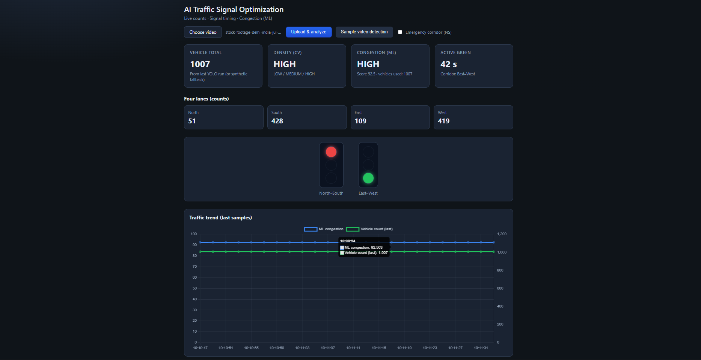
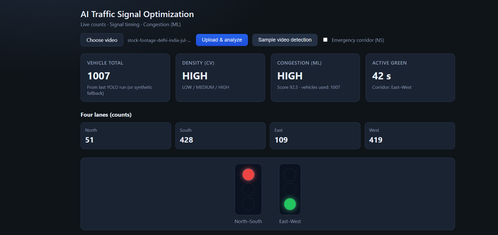
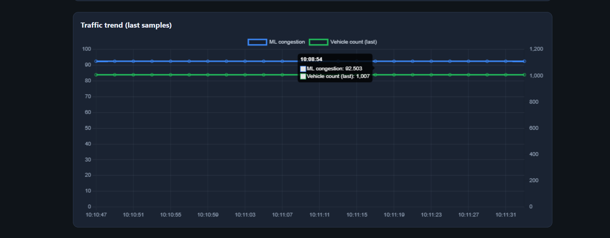

# 🚦 Automated Traffic Signal Control Using Real-Time Traffic Analysis

An AI-powered intelligent traffic management system that optimizes traffic signal timings by analyzing live traffic conditions using Computer Vision, Machine Learning, and a Flask-based web application.

The system detects vehicles in real time, predicts traffic congestion, dynamically adjusts signal timings, prioritizes emergency vehicles, and visualizes all traffic information through an interactive dashboard.

---

# 📌 Features

### 🚗 Real-Time Vehicle Detection

* Detects and counts vehicles using **YOLOv8** and **OpenCV**.
* Processes recorded videos or live traffic feeds.

### 🚦 Intelligent Signal Control

* Automatically adjusts traffic signal durations according to current traffic density.
* Reduces unnecessary waiting time and improves traffic flow.

### 🚑 Emergency Vehicle Priority

* Detects ambulances, police vehicles, and fire trucks.
* Creates a virtual green corridor by prioritizing emergency traffic.

### 📊 Traffic Congestion Prediction

* Uses Machine Learning models to estimate congestion levels based on traffic patterns.
* Supports proactive signal optimization.

### 🗄 MongoDB Integration

* Stores vehicle counts, signal timings, congestion predictions, and traffic logs.

### 📈 Interactive Web Dashboard

* Displays live vehicle counts.
* Shows current signal status.
* Visualizes congestion trends using charts.
* Displays emergency alerts in real time.

### 🛣 Four-Way Junction Simulation

* Simulates adaptive traffic control for a four-road intersection.

---

# 📂 Project Structure

```text
Automated-Traffic-Signal-Control/
│
├── backend/
│   ├── app.py
│   ├── routes/
│   │   └── traffic_routes.py
│   ├── services/
│   │   ├── traffic_service.py
│   │   └── emergency_service.py
│   ├── models/
│   │   └── mongo_models.py
│   └── utils/
│       └── config.py
│
├── ai/
│   ├── yolo_detection.py
│   ├── traffic_model.py
│   └── dataset/
│       ├── traffic_data.csv
│       └── sample_traffic.mp4
│
├── frontend/
│   ├── index.html
│   ├── style.css
│   └── script.js
│
├── database/
│   └── mongo_setup.py
│
├── requirements.txt
└── README.md
```

---

# 🛠 Technologies Used

* Python
* Flask
* OpenCV
* YOLOv8 (Ultralytics)
* Scikit-learn
* MongoDB
* HTML
* CSS
* JavaScript
* Chart.js

---
## 📋 Prerequisites

Before running the project, ensure you have the following installed:

* Python 3.10 or later
* MongoDB Community Server (Optional – required only for storing traffic logs and analytics)

**Sample Traffic Video**

```text
ai/dataset/sample_traffic.mp4
```

> **Note:** YOLOv8 model weights will be downloaded automatically during the first execution if they are not already available.

---

# ⚙️ Installation

### 1. Create a Virtual Environment

```bash
python -m venv .venv
```

### 2. Activate the Virtual Environment

**Windows**

```bash
.\.venv\Scripts\activate
```

### 3. Install Dependencies

```bash
pip install -r requirements.txt
```

---

# ▶️ Running the Application

Navigate to the backend folder:

```bash
cd backend
```

Start the Flask server:

```bash
python app.py
```

Open your browser and visit:

```text
http://127.0.0.1:5000/
```

The Flask backend serves the frontend dashboard automatically.


# 🔗 API Endpoints

## Process Traffic Video

**POST**

```text
/api/process_video
```

Example Request

```json
{
    "source": "file",
    "path": "../ai/dataset/sample_traffic.mp4"
}
```

---

## Get Current Signal Information

**GET**

```text
/api/get_signal
```

Returns

* Current active signal
* Signal duration
* Vehicle density

---

## Emergency Vehicle Control

**POST**

```text
/api/emergency
```

Example

```json
{
    "active": true
}
```

---

## Predict Traffic Congestion

**POST**

```text
/api/predict
```

Returns

* Congestion level
* Prediction score
* Machine learning analysis

---

# 🔄 System Workflow

```text
Traffic Video
      │
      ▼
Vehicle Detection (YOLOv8)
      │
      ▼
Traffic Density Analysis
      │
      ▼
Machine Learning Prediction
      │
      ▼
Adaptive Signal Optimization
      │
      ▼
Dashboard Visualization
```

---

# 🤖 Machine Learning Model

The ML model is implemented in:

```text
ai/traffic_model.py
```

Algorithms Used:

* RandomForestRegressor
* RandomForestClassifier

The model is retrained each time the application starts for demonstration purposes.

---

# 📁 Dataset

Dataset Location:

```text
ai/dataset/traffic_data.csv
```

Dataset includes:

* Vehicle counts
* Time-based traffic information
* Congestion labels
* Simulated traffic scenarios

---

# ⚠ Current Limitations

* Uses a sample traffic video for demonstration.
* Lane detection is based on predefined regions.
* Emergency vehicle identification depends on YOLO object detection.
* Designed primarily for educational and research purposes.

---

# 🚀 Future Enhancements

* Live CCTV integration
* Multi-intersection traffic coordination
* Cloud database support
* Edge AI deployment
* Advanced deep learning models
* Real-time traffic heatmaps
* User authentication and admin dashboard
* Historical traffic analytics

---

# 📸 Project Screenshots

## 🚦 Dashboard Overview



## 🚗 Traffic Monitoring



## 📊 Analytics Dashboard



# 👩‍💻 Author

Developed as an AI-based traffic management project to demonstrate intelligent traffic signal optimization using Computer Vision, Machine Learning, and real-time traffic analysis.
